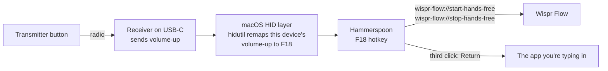

# DJI Mic for Wispr Flow

Use the button on your **DJI Mic Mini** transmitter to control [Wispr Flow](https://wisprflow.ai) on macOS. Click to start dictating, click to stop, and click once more to send.

It uses a macOS built-in tool (`hidutil`) and a small [Hammerspoon](https://www.hammerspoon.org) module:
- No Karabiner, and no driver or system extension to approve.
- No sudo.
- Your keyboard's volume keys keep working.

## Usage

Click the link button on the transmitter clipped to your shirt:

| Click | What happens |
|---|---|
| 1st | Wispr starts hands-free dictation |
| 2nd | Wispr stops and pastes your text; **↩ Press again to send** appears for 4 seconds |
| 3rd, while that's showing | Presses Return, so your message goes out |
| 3rd, after it's gone | Starts a new dictation |

Wait for your text to appear before the third click. A click before Wispr pastes sends Return too early.

## Requirements

- macOS (tested on 27.0)
- A DJI Mic Mini or Mic Mini 2 with the **receiver plugged into the Mac by USB-C**. The button doesn't reach the Mac over Bluetooth.
- [Wispr Flow](https://wisprflow.ai) (tested on 1.6.886)
- [Hammerspoon](https://www.hammerspoon.org) (tested on 1.1.1)
- [`just`](https://github.com/casey/just)

Other DJI Mic models are untested. They may use different IDs; see [Adapting it](#adapting-it).

## Install

```sh
brew install --cask hammerspoon
brew install just
git clone https://github.com/saqibnizami/dji-mic-for-wispr-flow.git
cd dji-mic-for-wispr-flow
just install
```

`just install` does three things:
1. Links the module into `~/.hammerspoon/`.
2. Adds two lines to your `init.lua`, leaving everything else in it alone.
3. Reloads Hammerspoon.

Open Hammerspoon once first if it has never run.

## Setup

1. **Allow sending Return.** Go to System Settings → Privacy & Security → Accessibility and turn on **Hammerspoon**. Then quit and reopen Hammerspoon. Starting and stopping dictation work without this; only the third-click send needs it.
2. **Start at login.** Hammerspoon → Preferences → tick **Launch Hammerspoon at login**.

Click the button once and Wispr should start listening.

## How it works

The DJI receiver reports the button as a **volume-up key**. You can't just remap volume-up in software, because that would hijack your keyboard's volume key too: once a keypress reaches apps like Hammerspoon, macOS no longer says which device it came from.

One layer lower, macOS still knows. Its built-in `hidutil` can remap keys on **one device only**. So this project turns the receiver's volume-up into **F18**, a key nothing else sends, before any app sees it. Hammerspoon then treats F18 as the button and drives Wispr Flow through its `wispr-flow://` links.



The module also takes care of a few details:
- **Keeps the remap in place.** macOS drops the remap when the receiver is unplugged or the Mac restarts, so the module reapplies it when it loads, when the receiver is plugged in, and after the Mac wakes.
- **Tells you when something's wrong.** If the remap fails, or sending needs Accessibility, you get an on-screen alert instead of a click that does nothing.
- **Stays in step with Wispr.** Wispr's links can start or stop dictation but can't tell you which state it's in, so the module keeps track. If it ever gets out of step, one extra click fixes it.

[docs/research.md](docs/research.md) has the full story with sources:
- Why Hammerspoon alone can't tell devices apart.
- What the button actually sends.
- The Karabiner alternative.
- How to check whether a managed Mac allows each approach.

## Adapting it

Everything to change is at the top of [`hammerspoon/dji_wispr.lua`](hammerspoon/dji_wispr.lua).

- **A different device.** A foot pedal, a macro pad or another wireless receiver works the same way. Find its IDs with `hidutil list`, then update `DJI_VENDOR_ID`, `DJI_PRODUCT_ID` and `DJI_MATCHING`. If it doesn't send volume keys, also change the sources in `DJI_KEY_MAPPING`.
- **A different key.** If something already uses F18, switch the destination in `DJI_KEY_MAPPING` to F19 (`0x70000006E`) or F20 (`0x70000006F`), and change the key in `hs.hotkey.bind` to match.
- **A longer send window.** Raise `SEND_WINDOW_SECONDS`.
- **A different dictation app.** Point `open_wispr_route` at that app's URL scheme or shortcut.

## Troubleshooting

**Hammerspoon says "Accessibility is not enabled" but System Settings shows it on.** Quit and reopen Hammerspoon. Its preferences window doesn't always notice the change. To check the live state:

```sh
/Applications/Hammerspoon.app/Contents/Frameworks/hs/hs -c 'hs.accessibilityState()'
```

**The button changes the volume again.** The remap is gone. Unplug and replug the receiver, or reload Hammerspoon. `just mapping` shows whether it's applied.

**Nothing happens when I click.** Check that the receiver is on USB-C, not Bluetooth, and that the transmitter is linked to it. `just console` logs every click as `dji button press …`.

**Karabiner-Elements is installed.** If Karabiner is set to modify the receiver, it takes the device over and this remap stops applying. Either set the receiver to ignored in Karabiner's Devices settings, or use the Karabiner rules in [`karabiner/`](karabiner/) instead of this remap.

## Development

| Command | What it does |
|---|---|
| `just test-remap` | Checks that the button arrives as F18 without changing the volume. Needs no permissions; quit Hammerspoon first. |
| `just probe` | A deeper two-phase probe. Needs Input Monitoring for your terminal; quit Hammerspoon first. |
| `just mapping` | Shows the remap currently applied to the receiver. |
| `just console` | Shows the module's log lines from Hammerspoon. |
| `just mic-in-use` | Lists which microphones are being captured right now. |
| `just lint` | Lints the scripts, syntax-checks the Lua, and validates the Karabiner rules. |

Building the probes needs the Xcode Command Line Tools. `just lint` also needs `shellcheck` and `luajit`. The test and probe scripts undo their remap when they exit, including on Ctrl-C.

## Credits

- [conchoecia/dji-mic-button](https://github.com/conchoecia/dji-mic-button) worked out what the button sends.
- [caezium/dji-mic-wispr-flow](https://github.com/caezium/dji-mic-wispr-flow) built the Karabiner version.
- [Johnixr/dji-mic-dictation](https://github.com/Johnixr/dji-mic-dictation) had the click-again-to-send idea.

## License

[MIT](LICENSE)
