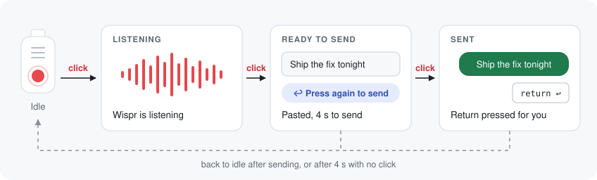
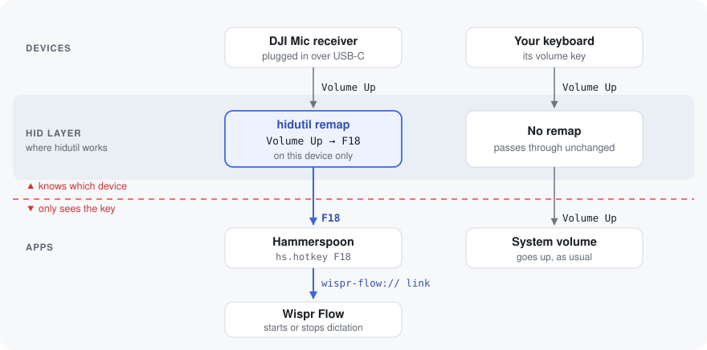

<h1 align="center">DJI Mic for Wispr Flow</h1>

<p align="center">
  Use the button on your DJI Mic Mini to dictate with <a href="https://wisprflow.ai">Wispr Flow</a> on macOS.<br>
  Click to talk, click to stop, click once more to send.
</p>

<p align="center">
  
  
  
</p>

<p align="center">
  
</p>

It uses a macOS built-in tool (`hidutil`) and [Hammerspoon](https://www.hammerspoon.org):
- No Karabiner, and no driver or system extension to approve.
- No sudo.
- Your keyboard's volume keys keep working.

Wait for your text to appear before the third click. A click before Wispr pastes sends Return too early.

After stopping, a compact dark pill appears in the screen center with “Press again to send” and an eight-second countdown. Its ring shrinks as the send window runs out; the hint disappears when you send or the time expires. Click the small × at its upper-right corner to cancel the send window immediately. Your dictated text stays in place, and the next transmitter press starts a new dictation.

## Requirements

- macOS (tested on 27.0)
- A DJI Mic Mini or Mic Mini 2 with the **receiver plugged into the Mac by USB-C**. The button doesn't reach the Mac over Bluetooth.
- [Wispr Flow](https://wisprflow.ai) (tested on 1.6.886)
- [Hammerspoon](https://www.hammerspoon.org) (tested on 1.1.1)
- [`just`](https://github.com/casey/just)
- Xcode Command Line Tools to build the native battery reader (`xcode-select --install`)

Other DJI Mic models are untested. They may use different IDs; see [Adapting it](#adapting-it).

## Install

```sh
brew install --cask hammerspoon
brew install just
git clone https://github.com/saqibnizami/dji-mic-for-wispr-flow.git
cd dji-mic-for-wispr-flow
just install
```

`just install` builds the battery reader, copies both modules, the executable and the
DJI logo into `~/.hammerspoon/`, enables both modules in `init.lua`, and reloads
Hammerspoon. Other configuration is preserved, and changed Lua modules are backed up.
The installed files are independent of this checkout; moving or deleting it does
not affect the installed integration. Run `just install` again to apply source changes.

Open Hammerspoon once first if it has never run.

## Setup

1. **Allow sending Return.** Go to System Settings → Privacy & Security → Accessibility and turn on **Hammerspoon**. Then quit and reopen Hammerspoon. Starting and stopping dictation work without this; only the third-click send needs it.
2. **Start at login.** Hammerspoon → Preferences → tick **Launch Hammerspoon at login**.

Click the button once and Wispr should start listening.

## Battery indicator

The battery indicator supports a DJI Mic Mini receiver on **firmware version 2**,
connected by USB-C. It is included in `just install`. To update only the battery
indicator without reloading the Wispr controls:

```sh
just install-battery
```

A **DJI** logo appears in the macOS menu bar for each connected transmitter,
ordered TX1 then TX2. Click it to see which transmitter each icon represents and its
charging status. A low battery adds `!`; charging adds a lightning symbol.
The icon disappears when the USB receiver is disconnected and returns when it is
connected again. The battery reader keeps running while the icon is hidden.

The receiver reports **seven battery levels**, from full to empty, rather than an exact
percentage. A solid background fills from the left with the logo cut out of it;
the remaining portion shows the plain logo. Full charge shows the whole solid badge,
and empty shows the plain logo. At half charge, the left half shows the cutout and
the right half shows the plain logo. The split moves in six increments
between full and empty and adapts to light and dark menu bars. An unknown or
unavailable reading shows `?`, and stale readings disappear. The reader reconnects
automatically after the receiver is unplugged or stops sending data.
While the menu is open, it keeps the displayed reading; queued updates are applied
when the menu closes. The USB reader detects missing data independently of menu timing.

Each transmitter's menu entry includes a runtime estimate, such as `~5.8 hours left`.
It scales [DJI's 11.5-hour transmitter rating](https://www.dji.com/mic-mini/specs)
by the icon's charge fraction: `11.5 × (7 - gauge) / 6`, rounded to one decimal place.
DJI's rating uses noise cancellation off; actual runtime varies. Unknown readings
have no runtime estimate.

The helper reads only USB interface 6's status endpoint. It sends no DJI settings
commands and does not capture the device or detach the audio/HID drivers.
A battery-only update leaves the existing Wispr module loaded. Hammerspoon's launch-at-login
setting also starts the battery display on login.

Use `just battery` for a one-shot JSON reading and `just test-battery` for decoder checks.
Only one battery reader should run at a time: choose **Reconnect battery reader** after
using another USB control app. **Hide until Hammerspoon reloads** stops the reader
and shows recovery instructions. To restore it, click the **Hammerspoon** menu-bar
icon and select **Reload Config**, or run `just install-battery`.
To disable it permanently, remove
`require("dji_battery").start()` from `~/.hammerspoon/init.lua` and reload Hammerspoon.

The read-only decoder is based on
[DJI Mic Control's reverse-engineered protocol](https://github.com/ShadowBitBasher/DJI-Mic-Control/blob/main/PROTOCOL.md).
The reader supports the first matching receiver; it does not display the receiver or
charging case's own battery level.

## How it works

<p align="center">
  
</p>

The DJI receiver reports the button as a **volume-up key**, the same key your keyboard sends. You can't just remap volume-up in an app like Hammerspoon, because by the time a keypress reaches it, macOS no longer says which device it came from. You'd hijack your keyboard's volume key too.

One layer lower, macOS still knows. Its built-in `hidutil` can remap keys on **one device only**. So the receiver's volume-up becomes **F18**, a key nothing else sends, before any app sees it. Hammerspoon then treats F18 as the button and drives Wispr Flow through its `wispr-flow://` links.

The module also takes care of a few details:
- **Keeps the remap in place.** macOS drops the remap when the receiver is unplugged or the Mac restarts, so the module reapplies it when it loads, when the receiver is plugged in, and after the Mac wakes.
- **Tells you when something's wrong.** If the remap fails, or sending needs Accessibility, you get an on-screen alert instead of a click that does nothing.
- **Stays in step with Wispr.** Wispr's links can start or stop dictation but can't tell you which state it's in, so the module keeps track. If it ever gets out of step, one extra click fixes it.

[docs/research.md](docs/research.md) has the full story with sources:
- Why Hammerspoon alone can't tell devices apart.
- What the button actually sends.
- The Karabiner alternative.
- How to check whether a managed Mac allows each approach.

## Adapting it

Everything to change is at the top of [`hammerspoon/dji_wispr.lua`](hammerspoon/dji_wispr.lua).

- **A different device.** A foot pedal, a macro pad or another wireless receiver works the same way. Find its IDs with `hidutil list`, then update `DJI_VENDOR_ID`, `DJI_PRODUCT_ID` and `DJI_MATCHING`. If it doesn't send volume keys, also change the sources in `DJI_KEY_MAPPING`.
- **A different key.** If something already uses F18, switch the destination in `DJI_KEY_MAPPING` to F19 (`0x70000006E`) or F20 (`0x70000006F`), and change the key in `hs.hotkey.bind` to match.
- **A longer send window.** Raise `SEND_WINDOW_SECONDS`.
- **A different hint position.** Change `SEND_WIDGET_SCREEN_Y` (`0.5` centers it vertically on the usable screen).
- **A different dictation app.** Point `open_wispr_route` at that app's URL scheme or shortcut.

## Troubleshooting

**Hammerspoon says "Accessibility is not enabled" but System Settings shows it on.** Quit and reopen Hammerspoon. Its preferences window doesn't always notice the change. To check the live state:

```sh
/Applications/Hammerspoon.app/Contents/Frameworks/hs/hs -c 'hs.accessibilityState()'
```

**The button changes the volume again.** The remap is gone. Unplug and replug the receiver, or reload Hammerspoon. `just mapping` shows whether it's applied.

**Nothing happens when I click.** Check that the receiver is on USB-C, not Bluetooth, and that the transmitter is linked to it. `just console` logs every click as `dji button press …`.

**Karabiner-Elements is installed.** If Karabiner is set to modify the receiver, it takes the device over and this remap stops applying. Either set the receiver to ignored in Karabiner's Devices settings, or use the Karabiner rules in [`karabiner/`](karabiner/) instead of this remap.

## Development

| Command | What it does |
|---|---|
| `just test-battery` | Checks the USB battery protocol decoder. |
| `just test-battery-menu` | Checks menu estimates, USB visibility and lifecycle using isolated device events. Requires Hammerspoon with IPC enabled. |
| `just test-wispr-widget` | Checks close-button cancellation, countdown and send behavior without starting dictation or sending keystrokes. Requires Hammerspoon with IPC enabled. |
| `just test-install` | Checks clean installation, repeat updates and migration from old symlinks in a temporary directory. |
| `just test-remap` | Checks that the button arrives as F18 without changing the volume. Needs no permissions; quit Hammerspoon first. |
| `just probe` | A deeper two-phase probe. Needs Input Monitoring for your terminal; quit Hammerspoon first. |
| `just mapping` | Shows the remap currently applied to the receiver. |
| `just console` | Shows the module's log lines from Hammerspoon. |
| `just mic-in-use` | Lists which microphones are being captured right now. |
| `just lint` | Lints the scripts, syntax-checks the Lua, and validates the Karabiner rules. |

Building the probes needs the Xcode Command Line Tools. `just lint` also needs `shellcheck` and `luajit`. The test and probe scripts undo their remap when they exit, including on Ctrl-C.

The diagrams in `docs/images/` are hand-written SVGs. Each one has its own light and dark palette.

## Credits

- [conchoecia/dji-mic-button](https://github.com/conchoecia/dji-mic-button) worked out what the button sends.
- [caezium/dji-mic-wispr-flow](https://github.com/caezium/dji-mic-wispr-flow) built the Karabiner version.
- [Johnixr/dji-mic-dictation](https://github.com/Johnixr/dji-mic-dictation) had the click-again-to-send idea.

## License

[MIT](LICENSE)
